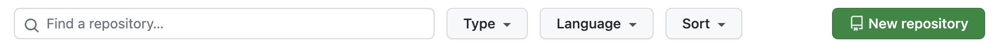
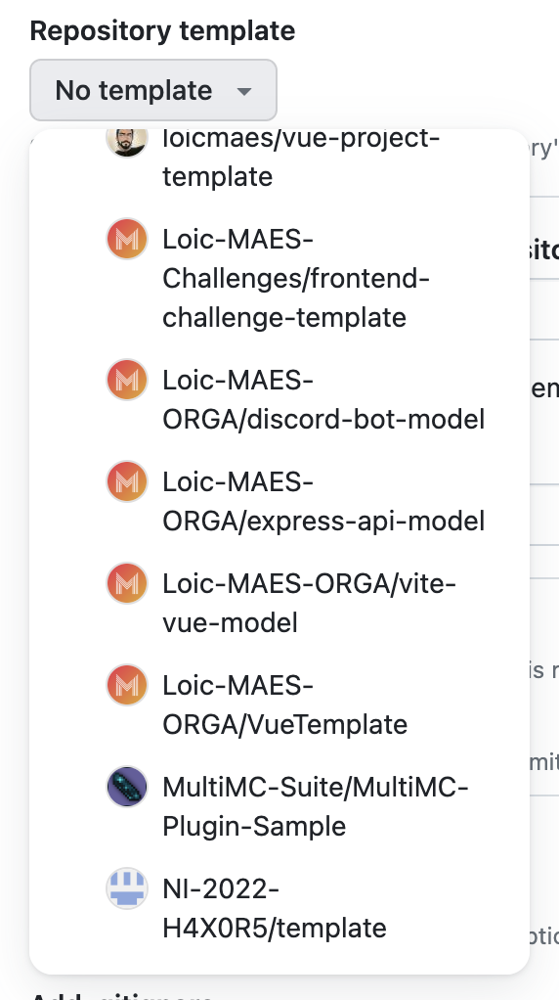
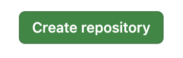

# Vue Template
Welcome on this vue project template using vite to run.  
Here, you'll find some basics components, a relatively complete CSS reset (will be upgraded soon) and a bunch of small
components ready to use.

Let's discover it together.

## Table of content
- [Start a project](#start-a-project)
  - [Use the template](#use-the-template)
  - [Clone the repository](#clone-repository)
- [Project structure](#project-structure)
- [Components library](#components-library)

## Start a project
To start a project, you have 2 options :

---

<a name="use-the-template"></a>**1. Use the template provided publicly in this organization;**  
Start by creating your own repository  
  
Then, select the repository template  
  
Finally, fill all required fields and click on "Create Repository".  


---

<a name="clone-repository"></a>**2. Clone the repository and push it in your own.**  
If you don't find the template or wanna simply clone it, it's simple:

Open your terminal and type:
```shell
# SSH way
git clone git@github.com:Loic-MAES-ORGA/VueTemplate.git [target_dir_name]
# HTTPS way
git clone https://github.com/Loic-MAES-ORGA/VueTemplate.git [target_dir_name]
```

Then, update your remote to set your own:
```shell
# SSH way
git remote set-url origin git@github.com:[organisation/user]/[repository]
# HTTPS way
git remote set-url origin https://github.com/[organisation/user]/[repository]
```

---

When you've set up your template, run:
```shell
# NPM version
npm i
# PNPM version
pnpm i
```

Then, you would be able to use the template and start the server:
```shell
# NPM version
npm run dev
# PNPM version
pnpm run dev
```

## Project structure
This is how the project is composed:
- [`public/`](public): _Public directory._
- [`src/`](src): _Application's root folder._
  - [`assets/`](src/assets): _Compiled assets (like css sheets, js scripts...)._
  - [`components/`](src/components): _Custom components (with default [icon render component](src/components/display/misc/Icon.vue))._
  - [`layouts/`](src/layouts): _Application layouts._
  - [`router/`](src/router): _[Vue-Router](https://router.vuejs.org/) plugin's configuration._
  - [`store/`](src/store): _[VueX](https://vuex.vuejs.org/) plugin's configuration._
  - [`views/`](src/views): _Application views._
  - [`App.vue`](src/App.vue): _Vue application base component._
  - [`main.js`](src/main.js): _Vue application starting point._
- [`index.html`](index.html): _HTML page which will be rendered._
- [`vite.config.js`](vite.config.js): _Vite configuration's file._

## Components library
### Icon render
[File access](src/components/display/misc/Icon.vue)  
**_How to use this component?_**  
First, you'll need to setup your icon library
```vue
<span class="icon" v-if="icon">
  <!-- Setup it here -->
  <!-- Example: -->
  <svg v-if="icon === 'heart'" view-box="0 0 18 18" fill="none">...</svg>
</span>
```
Then, use it like this:
```vue
<Icon icon="icon_name" />
```
Pretty easy nah?

---

Thanks for using this template 👍. Please support me on my social networks:
- Instagram: [@uiux.loicmaes](https://www.instagram.com/uiux.loicmaes)
- GitHub: [@loicmaes](https://www.github.com/loicmaes)
- Linkedin: [@maesloic](https://www.linkedin.com/in/maesloic)

> Developed and designed with ❤️ by [Loïc MAES](https://www.maesloic.fr/) in 2023.
